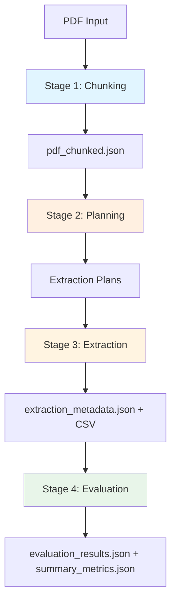

# CoRal-Map-Make: Clinical Trial Data Extraction Pipeline

This repository contains a **plan-based extraction pipeline (V2)** for extracting structured data from clinical trial research papers (PDFs) using Large Language Models. The pipeline has four stages: **Chunking → Planning → Extraction → Evaluation**, with explicit extraction plans for interpretability and category-aware evaluation.

---

## Table of Contents

1. [Pipeline Overview](#pipeline-overview)
2. [Architecture & Complete Flow](#architecture--complete-flow)
3. [Module Reference (`src/`)](#module-reference-src)
4. [Configuration](#configuration)
5. [Output Structure](#output-structure)
6. [Setup and Dependencies](#setup-and-dependencies)
7. [Usage](#usage)
8. [Preprocessing (used by Chunking)](#preprocessing-used-by-chunking)
9. [Architecture Notes](#architecture-notes)

---

## Pipeline Overview

High-level flow:



- **Stage 1 (Chunking):** PDF → text/table/figure chunks, with optional LLM-based page classification.
- **Stage 2 (Planning):** For each column group, an LLM (with PDF + chunks) produces a free-form extraction plan; a local structurer turns it into JSON (where to look, page, source_type, confidence).
- **Stage 3 (Extraction):** Plans are executed: for each group, the LLM extracts values from plan-relevant chunks; structurer produces structured extractions; results are merged into one row + metadata.
- **Stage 4 (Evaluation):** Extracted row is compared to ground truth with category-aware scoring (exact_match, numeric_tolerance, structured_text); correctness/completeness per column and summary metrics.

---

## Architecture & Complete Flow

### Data Flow

```
PDF
  │
  ▼
┌─────────────────────────────────────────────────────────────────┐
│  STAGE 1: CHUNKING                                               │
│  process_pdf() → optional PageClassifier → PDFChunker.chunk()    │
│  Output: chunking/pdf_chunked.json                               │
└─────────────────────────────────────────────────────────────────┘
  │
  ▼
┌─────────────────────────────────────────────────────────────────┐
│  STAGE 2: PLANNING                                               │
│  PlanGenerator.generate_plans(pdf, chunks)                       │
│  • LLM (e.g. Gemini) + PDF → free-form plan per group           │
│  • OutputStructurer (local Qwen) → GroupExtractionPlanV2 JSON    │
│  Output: planning/*_plan.json, plans_all_columns.json            │
└─────────────────────────────────────────────────────────────────┘
  │
  ▼
┌─────────────────────────────────────────────────────────────────┐
│  STAGE 3: EXTRACTION                                             │
│  PlanExecutor.execute_plans(pdf, chunks, plans)                 │
│  • For each group: find_relevant_chunks(plan) → LLM + PDF       │
│  • OutputStructurer → GroupExtractionV2 → merge                  │
│  Output: extraction/extraction_metadata.json, extracted_table.csv│
└─────────────────────────────────────────────────────────────────┘
  │
  ▼
┌─────────────────────────────────────────────────────────────────┐
│  STAGE 4: EVALUATION                                             │
│  EvaluatorV2.run()                                               │
│  • Load extraction + ground truth + definitions (with category) │
│  • Batches by category → Gemini judge → structurer → scores      │
│  Output: evaluation/evaluation_results.json, summary_metrics.json│
└─────────────────────────────────────────────────────────────────┘
```

### Module Map

| Stage / Cross-cutting | Directory / File | Role |
|------------------------|------------------|------|
| Entry point | `src/main/main_v2.py` | CLI menu, runs 1–6 (chunk only, plan only, extract only, eval only, full pipeline, or plan→extract→eval from existing chunks). |
| Config | `src/config/config.py` | Paths, API keys, per-stage providers/models, chunking/planning/extraction/eval workers, structurer URL. |
| Chunking | `src/chunking/` | Page classification, PDF chunking (text, table, figure), preprocessing hooks. |
| Planning | `src/planning/plan_generator.py` | PlanGenerator: LLM + PDF → plan text → structurer → `GroupExtractionPlanV2` per group. |
| Extraction | `src/extraction/plan_executor.py` | PlanExecutor: load plans, find relevant chunks, LLM extract → structurer → `GroupExtractionV2`, merge and write CSV + metadata. |
| LLM | `src/LLMProvider/provider.py` | LLMProvider: Gemini, OpenAI, Novita, Groq, DeepInfra; `generate()`, `generate_with_pdf()`, `upload_pdf`/`cleanup_pdf`. |
| Structurer | `src/LLMProvider/structurer.py` | OutputStructurer: free-form text → JSON via local model (e.g. vLLM Qwen) with Pydantic schema. |
| Table defs | `src/table_definitions/definitions.py` | `load_definitions()`: column groups from CSV (Label → list of Column Name + Definition). |
| Evaluation | `src/evaluation/evaluator_v2.py` | EvaluatorV2: load data, group by eval category, batch, Gemini judge, structurer, aggregate and save. |
| Preprocessing | `src/preprocessing/pdf_margin_preprocessing.py` | Header/footer detection and cleaning used during chunking. |
| Utils | `src/utils/logging_utils.py` | `setup_logger()` for consistent logging. |

---

## Module Reference (`src/`)

### `src/main/main_v2.py`

- **Entry point:** `main()` (interactive PDF path + menu) or `run_pipeline_from_args(pdf_path, choice)` for programmatic/web use.
- **Choices:** `1` Chunking only; `2` Planning only; `3` Extraction only; `4` Evaluation only; `5` Full pipeline; `6` Planning → Extraction → Evaluation (reuse existing chunks).
- **Helpers:** `run_chunking()`, `run_planning()`, `run_extraction()`, `run_evaluation()`; `create_versioned_output_dir()` when `VERSION_OUTPUTS` is True; `_find_existing()` to resolve existing chunk/plan/extraction paths for skip-if-exists behavior.
- **Output root:** `RESULTS_BASE_DIR / pdf_name` (optionally with versioned `run_YYYY-MM-DD_HH-MM-SS` and `latest` symlink).

### `src/config/config.py`

- **API keys / cloud config:** From `.env`: `VERTEX_API_KEY` (local Vertex testing), `GOOGLE_CLOUD_PROJECT`, `GOOGLE_CLOUD_LOCATION`, `OPENAI_API_KEY`, `NOVITA_API_KEY`, `LLAMA_KEY` (Groq), `DEEPINFRA_API_KEY`.
- **Per-task LLM:** `CHUNKING_*`, `EXTRACTION_*`, `EVALUATION_*` (legacy); V2: `PLANNING_PROVIDER/MODEL`, `EXTRACTION_PROVIDER_V2/MODEL_V2`, `EVALUATION_PROVIDER_V2/MODEL_V2`; workers: `PLANNING_WORKERS`, `EXTRACTION_WORKERS`, `EVALUATION_WORKERS`.
- **Structurer (local):** `STRUCTURER_BASE_URL` (e.g. `http://localhost:8001/v1`), `STRUCTURER_MODEL` (e.g. `Qwen/Qwen3-8B`).
- **Chunking:** `TEXT_CHUNK_MIN_SIZE`, `CHUNKING_MODE`, `PIXMAP_RESOLUTION`, `USE_LLM_PAGE_CLASSIFICATION`, `PAGE_CLASSIFICATION_MODEL`.
- **Paths:** `DEFINITIONS_CSV_PATH`, `DEFINITIONS_EVAL_CATEGORY_PATH`, `GOLD_TABLE_JSON_PATH`, `RESULTS_BASE_DIR`.
- **Pipeline behavior:** `VERSION_OUTPUTS`, `SKIP_STAGE_IF_EXISTS`, `EXTRACTION_MODE` (e.g. `"plan"`).

### `src/chunking/`

- **`chunking.py`**
  - **`process_pdf(pdf_path, output_path, use_llm_classification)`:** Top-level entry. Optionally runs `PageClassifier.classify()` then builds `PDFChunker(pdf_path, page_metadata).chunk()`, saves JSON.
  - **`PDFChunker`:** Holds `table_pages`/`figure_pages` from metadata (or processes all pages). For each page: `_process_page_text()` (accumulate cleaned text), `_process_tables()` (LLM + optional pdfplumber fallback), `_process_figures()` (regex + LLM description). After all pages: `_create_large_text_chunks()` (sentence/paragraph chunking). Returns list of chunks (type: text/table/figure, content, page, etc.).
- **`page_classifier.py`**
  - **`PageClassifier`:** Uses Gemini to classify which pages have tables/figures; uses `OutputStructurer` to get `TablesResponse`/`FiguresResponse`. **`classify()`** returns `{"tables": [...], "figures": [...]}` for targeted chunking.
- **`utils_chunking.py`**
  - Text chunking (`text_chunking()`), table extraction helpers (`extract_tables_pdfplumber()`, `parse_table_extraction_response()`), image/LLM helpers (`ask_gemini_with_image()`, `extract_caption_from_gemini()`), `save_chunks_to_json()`; heuristic header/footer filtering used with preprocessing.

### `src/planning/plan_generator.py`

- **Data structures:** `Column`, `ColumnGroup`; `ColumnExtractionPlanV2` (column_index, column_name, found_in_pdf, page, source_type, confidence, extraction_plan), `GroupExtractionPlanV2` (group_name, columns).
- **`PlanGenerator(provider, definitions, structurer=None, name_policy)`:** Builds column groups from definitions; uses optional `OutputStructurer` (default from config).
- **`generate_plan_for_group(group, pdf_handle, chunks, output_dir)`:** Builds prompt with chunk summaries and canonical columns; calls `provider.generate_with_pdf()`; writes raw plan to `logs/{stem}_raw.txt`; calls `structurer.structure()` with `GroupExtractionPlanV2` schema; validates/normalizes with `validate_and_normalize_group_plan()`; saves `{stem}_plan.json`.
- **`generate_plans(pdf_path, chunks, output_dir, workers)`:** Uploads PDF, runs `generate_plan_for_group` per group in parallel (ThreadPoolExecutor), writes `plans_all_columns.json`, returns `{group_name: plan_data}`.

### `src/extraction/plan_executor.py`

- **Data structures:** `ColumnExtractionV2` (column_index, column_name, value, evidence, page, confidence), `GroupExtractionV2` (group_name, extractions).
- **Helpers:** `find_relevant_chunks(plan.columns, chunks)` (by source_type and page); `format_chunks()`, `format_columns_for_prompt()`; `validate_and_normalize_plan()`, `validate_and_normalize_extraction()`; `_generate_outputs()` (writes `extraction_metadata.json` and `extracted_table.csv`).
- **`_extract_group(...)`:** For a single group: filter plan to `found_in_pdf`, get relevant chunks, build prompt with columns + chunks; `provider.generate_with_pdf()`; log raw; `structurer.structure(GroupExtractionV2)` (with OpenAI/Gemini fallback on failure); normalize extraction and return `GroupExtractionV2`.
- **`PlanExecutor(provider, structurer, name_policy).execute_plans(pdf_path, chunks, plans, output_path, workers)`:** Loads definitions, validates plans, uploads PDF; runs `_extract_group` per group in parallel; calls `_generate_outputs()`; returns loaded metadata dict.
- **`load_plans_from_dir(plans_dir)`:** Loads from `plans_all_columns.json` or `*_plan.json` in the directory.

### `src/LLMProvider/provider.py`

- **`LLMProvider(provider, model)`:** Unified interface for Gemini, OpenAI, Novita, Groq, DeepInfra. Methods: `generate()`, `generate_with_image()`, `generate_with_pdf(prompt, pdf_handle, ...)`, `upload_pdf(path)` / `cleanup_pdf(handle)`, and batch helpers. Returns `LLMResponse` (text, tokens, cost, success, error).

### `src/LLMProvider/structurer.py`

- **`OutputStructurer(base_url, model, api_key, enable_thinking)`:** Uses OpenAI-compatible client (e.g. vLLM) to turn free-form text into JSON. **`structure(text, schema, max_retries, temperature, return_dict)`** builds a schema prompt, calls the model, parses JSON and validates with Pydantic; returns `StructurerResponse(data, success, attempts, error)`.

### `src/table_definitions/definitions.py`

- **`load_definitions(csv_path=None, cols_to_test_path=None)`:** Reads CSV (default from config); groups by `Label`; each group is list of `{"Column Name", "Definition"}`. Optional filter via `cols_to_test_path` (included labels).

### `src/evaluation/evaluator_v2.py`

- **`EvaluatorV2(extraction_file, ground_truth_file, definitions_file, document_name, output_dir)`:** Loads extraction JSON (flat column → value), ground truth JSON (document row by `Document Name`), definitions with eval categories (`Definitions_with_eval_category.csv`).
- **`load_data()`:** Fills `predicted_values`, `ground_truth_values`, `column_categories`, `column_definitions`, `column_labels`.
- **`group_columns_by_category()`:** Groups common columns into `exact_match`, `numeric_tolerance`, `structured_text`.
- **`build_prompt(category, columns)`:** Category-specific instructions (exact match, numeric tolerance, structured text) and column-wise GT vs Pred.
- **`evaluate_batch(category, columns)`:** Gemini evaluation prompt → `structure_response()` (Qwen structurer or Gemini fallback) → list of `{column, correctness, completeness, reason}`.
- **`evaluate_all(max_workers)`:** Batches by category/label, runs batches in parallel, stores results in `self.results`.
- **`aggregate_metrics()`:** Overall and per-category avg correctness/completeness/overall.
- **`save_results()`:** Writes `evaluation_results.json`, `summary_metrics.json`, `llm_logs/gemini_calls.jsonl`, `structurer_calls.jsonl`.
- **`run()`:** load_data → evaluate_all → save_results.

### `src/preprocessing/pdf_margin_preprocessing.py`

- **`detect_repeating_patterns(pdf_path, sample_pages)`:** Learns top/bottom repeating text patterns from first N pages.
- **`extract_text_blocks_with_position()`:** PyMuPDF text blocks with bounding boxes.
- **`is_header_or_footer_by_position()` / `by_pattern()` / `by_heuristics()`:** Filter blocks (used from chunking/utils).
- **`clean_page_text_advanced(page, page_height, patterns)`:** Applies position → pattern → heuristic filtering; returns cleaned page text.

### `src/utils/logging_utils.py`

- **`setup_logger(name)`:** Returns logger used across pipeline components.

---

## Configuration

Key settings in [`src/config/config.py`](src/config/config.py):

| Area | Variables |
|------|-----------|
| **V2 Planning** | `PLANNING_PROVIDER`, `PLANNING_MODEL`, `PLANNING_WORKERS` |
| **V2 Extraction** | `EXTRACTION_PROVIDER_V2`, `EXTRACTION_MODEL_V2`, `EXTRACTION_WORKERS` |
| **V2 Evaluation** | `EVALUATION_PROVIDER_V2`, `EVALUATION_MODEL_V2`, `EVALUATION_WORKERS` |
| **Structurer (local)** | `STRUCTURER_BASE_URL`, `STRUCTURER_MODEL` |
| **Chunking** | `TEXT_CHUNK_MIN_SIZE`, `CHUNKING_MODE`, `USE_LLM_PAGE_CLASSIFICATION`, `PAGE_CLASSIFICATION_MODEL`, `PIXMAP_RESOLUTION` |
| **Paths** | `DEFINITIONS_CSV_PATH`, `DEFINITIONS_EVAL_CATEGORY_PATH`, `GOLD_TABLE_JSON_PATH`, `RESULTS_BASE_DIR` |
| **Behavior** | `VERSION_OUTPUTS`, `SKIP_STAGE_IF_EXISTS` |

API keys / env (from `.env`): `VERTEX_API_KEY`, `GOOGLE_CLOUD_PROJECT`, `GOOGLE_CLOUD_LOCATION`, `OPENAI_API_KEY`, `NOVITA_API_KEY`, `LLAMA_KEY`, `DEEPINFRA_API_KEY`.

---

## Output Structure

With versioning enabled (`VERSION_OUTPUTS = True`), each run can create `run_YYYY-MM-DD_HH-MM-SS` under the document folder and `latest` symlink. Example:

```
RESULTS_BASE_DIR / {pdf_name} /
├── run_2025-02-05_12-00-00/          # or "latest" -> run_...
│   ├── chunking/
│   │   └── pdf_chunked.json
│   ├── planning/
│   │   ├── *_plan.json
│   │   ├── plans_all_columns.json
│   │   └── logs/
│   ├── extraction/
│   │   ├── extraction_metadata.json
│   │   ├── extracted_table.csv
│   │   └── logs/
│   └── evaluation/
│       ├── evaluation_results.json
│       ├── summary_metrics.json
│       └── llm_logs/
```

- **extraction_metadata.json:** Per-column value, evidence, page, plan info (e.g. plan_found_in_pdf, plan_page, plan_source_type).
- **summary_metrics.json:** Overall and by-category avg correctness, completeness, overall score.

---

## Setup and Dependencies

- **Python:** Install from [`src/requirements.txt`](src/requirements.txt):  
  `pip install -r src/requirements.txt`
- **spaCy:** `python -m spacy download en_core_web_sm`
- **Environment:** `.env` in project root with API keys (see Configuration).
- **Local structurer (vLLM):** For planning/extraction/structuring, run vLLM (e.g. `./run_vllm.sh`) so `STRUCTURER_BASE_URL` is reachable.
- **Column definitions:** `src/table_definitions/Definitions_open_ended.csv` (and `Definitions_with_eval_category.csv` for evaluation).
- **Ground truth:** `dataset/Manual_Benchmark_GoldTable_cleaned.json` (or path set in `GOLD_TABLE_JSON_PATH`) for evaluation.

---

## Usage

**Interactive (CLI):**

```bash
python src/main/main_v2.py
```

Enter PDF path when prompted, then choose 1–6 (chunk only, plan only, extract only, eval only, full pipeline, or plan→extract→eval from existing chunks).

**Programmatic / Web:**

```python
from pathlib import Path
from src.main.main_v2 import run_pipeline_from_args

run_dir, extraction_file, err = run_pipeline_from_args(
    Path("path/to/document.pdf"),
    "5"  # full pipeline
)
if err:
    print("Error:", err)
else:
    print("Run dir:", run_dir, "Extraction:", extraction_file)
```

**Run a single stage:** Use choices 1–4 and ensure prior stage outputs exist (or run 5 once). With `SKIP_STAGE_IF_EXISTS`, existing chunk/plan/extraction/eval files are reused when paths are found.

---

## Preprocessing (used by Chunking)

Chunking uses [`src/preprocessing/pdf_margin_preprocessing.py`](src/preprocessing/pdf_margin_preprocessing.py) to clean page text before building text chunks:

1. **Position-based:** Drop blocks in top/bottom margin regions (`TOP_MARGIN`, `BOTTOM_MARGIN`).
2. **Pattern-based:** `detect_repeating_patterns()` on first N pages; drop blocks matching learned top/bottom patterns.
3. **Heuristic-based:** (in `utils_chunking`) Short blocks, copyright/keywords, journal/volume/issue, dates, URLs, page numbers.

`clean_page_text_advanced()` applies all three; only blocks that pass are kept for accumulation and later text chunking.

---

## Architecture Notes

- **Plan-based extraction:** Planning produces explicit (group, column, page, source_type, confidence) plans; extraction follows these plans and only sends relevant chunks to the LLM, improving consistency and traceability.
- **Dual LLM roles:** Cloud LLM (e.g. Gemini/OpenAI) for PDF-aware planning and extraction; local structurer (e.g. Qwen via vLLM) for turning free-form text into strict JSON against Pydantic schemas.
- **Parallelism:** Planning and extraction run per-group in parallel (configurable workers); evaluation runs batches in parallel by category.
- **Skip-if-exists:** When `SKIP_STAGE_IF_EXISTS` is True, main_v2 looks for existing chunk/plan/extraction/eval outputs and skips re-running that stage.
- **Logging:** All stages use `setup_logger()` from `src/utils/logging_utils.py`; planning and extraction write raw LLM outputs under `logs/` in their output directories.

---

## License

[Add license information here]

## Citation

[Add citation information here]
