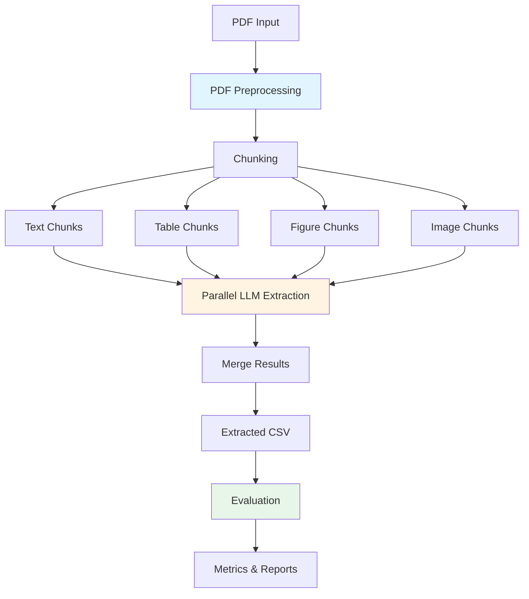

# CoRal-Map-Make: Clinical Trial Data Extraction Pipeline

This repository contains a comprehensive pipeline for extracting structured data from clinical trial research papers (PDFs) using Large Language Models (LLMs). The pipeline processes PDFs through three main stages: preprocessing, information extraction, and evaluation.

## Pipeline Overview

The pipeline follows this high-level flow:



## Table of Contents

1. [PDF Preprocessing](#1-pdf-preprocessing)
2. [Extracting Information from PDFs](#2-extracting-information-from-pdfs-iterative-loop)
3. [Evaluation of Extracted Information](#3-evaluation-of-extracted-information)
4. [Configuration](#configuration)
5. [Output Structure](#output-structure)
6. [Setup and Dependencies](#setup-and-dependencies)
7. [Usage](#usage)

---

## 1. PDF Preprocessing

### Summary

The preprocessing stage cleans PDF text by removing headers, footers, and metadata that would interfere with information extraction. The system uses a **multi-strategy approach** combining three complementary filtering methods:

1. **Position-based filtering**: Removes text blocks located in predefined top/bottom margin regions
2. **Pattern-based filtering**: Learns repeating header/footer patterns from the first few pages of the document
3. **Heuristic-based filtering**: Uses keyword and pattern matching to identify common journal-specific headers/footers

This multi-layered approach ensures robust cleaning across different journal formats and document styles.

### Key Functions and Components

#### Pattern Detection

**`detect_repeating_patterns()`** in [`src/preprocessing/pdf_margin_preprocessing.py`](src/preprocessing/pdf_margin_preprocessing.py) (lines 38-94)
- Analyzes the first N pages (default: 5) to identify repeating text patterns
- Extracts text blocks from top 10% and bottom 10% of each page
- Normalizes text by replacing numbers with placeholders for pattern matching
- Uses frequency counting to identify patterns that appear on multiple pages
- Returns dictionaries of `top_patterns` and `bottom_patterns`

```python
def detect_repeating_patterns(pdf_path, sample_pages=PATTERN_SAMPLE_PAGES):
    """Analyze first few pages to detect repeating headers/footers."""
    # Extracts top/bottom text blocks, normalizes, and finds common patterns
```

#### Text Block Extraction

**`extract_text_blocks_with_position()`** in [`src/preprocessing/pdf_margin_preprocessing.py`](src/preprocessing/pdf_margin_preprocessing.py) (lines 13-35)
- Extracts text blocks from PDF pages using PyMuPDF's `get_text("dict")` method
- Preserves bounding box coordinates `(x0, y0, x1, y1)` for each block
- Returns structured data with text content and position information
- Essential for position-based filtering

#### Position-Based Filtering

**`is_header_or_footer_by_position()`** in [`src/preprocessing/pdf_margin_preprocessing.py`](src/preprocessing/pdf_margin_preprocessing.py) (lines 97-109)
- Checks if a text block's vertical position falls within header/footer regions
- Header region: top 60 pixels (configurable via `TOP_MARGIN`)
- Footer region: bottom 60 pixels (configurable via `BOTTOM_MARGIN`)
- Fast and effective for standard document layouts

#### Pattern-Based Filtering

**`is_header_or_footer_by_pattern()`** in [`src/preprocessing/pdf_margin_preprocessing.py`](src/preprocessing/pdf_margin_preprocessing.py) (lines 112-120)
- Compares text against learned patterns from `detect_repeating_patterns()`
- Normalizes input text (lowercase, number replacement) for matching
- Catches document-specific repeating headers/footers that position-based filtering might miss

#### Heuristic-Based Filtering

**`is_header_or_footer_by_heuristics()`** in [`src/chunking/utils_chunking.py`](src/chunking/utils_chunking.py) (lines 220-267)
- Uses general heuristics to detect common header/footer patterns across journals
- Checks for:
  - Short text blocks (< 150 characters)
  - Copyright keywords (`copyright`, `all rights reserved`, etc.)
  - Journal abbreviations with volume/issue numbers
  - Date patterns (e.g., "July 27, 2017")
  - URL patterns (e.g., "nejm.org")
  - Standalone page numbers
- Catches journal-specific metadata that position/pattern methods might miss

#### Orchestration

**`clean_page_text_advanced()`** in [`src/preprocessing/pdf_margin_preprocessing.py`](src/preprocessing/pdf_margin_preprocessing.py) (lines 123-150)
- Main function that orchestrates all three filtering strategies
- Processes each text block through the filters in sequence:
  1. Position check → skip if in margin region
  2. Pattern check → skip if matches learned patterns
  3. Heuristic check → skip if matches common patterns
- Only blocks passing all three filters are retained
- Returns cleaned text with headers/footers removed

```python
def clean_page_text_advanced(page, page_height, patterns):
    """Extract and clean text using multiple strategies."""
    # Applies position → pattern → heuristic filtering
```

---

## 2. Extracting Information from PDFs (Iterative Loop)

### Summary

The extraction stage transforms cleaned PDF content into structured data through a **two-phase process**:

1. **Chunking Phase**: Breaks the PDF into semantically meaningful chunks (text, tables, figures, images)
2. **Extraction Phase**: Uses LLMs to extract structured data from chunks in parallel across all column-group and chunk combinations

The extraction phase implements an **iterative loop** where each column group is processed against every chunk. Results are merged using a "first non-null" strategy: the first chunk that provides a value for a column is used, and subsequent chunks are only considered for columns that remain null.

### Key Functions and Components

#### Chunking Phase

**`PDFChunker.chunk()`** in [`src/chunking/chunking.py`](src/chunking/chunking.py) (lines 107-141)
- Main orchestration method for the chunking process
- Processes each page sequentially, extracting:
  - Text chunks (sentence-based)
  - Tables (via pdfplumber + multimodal LLM analysis)
  - Figures (detected via regex, analyzed with multimodal LLM)
  - Embedded images (extracted directly from PDF)
- Stops processing at "References" or "Bibliography" sections
- Returns a list of chunk dictionaries with type, content, page number, and metadata

**`_process_page_text()`** in [`src/chunking/chunking.py`](src/chunking/chunking.py) (lines 37-55)
- Processes text content for a single page
- Uses `clean_page_text_advanced()` to get cleaned text
- Detects "References" section and truncates text if found
- Calls `text_chunking()` to split text into sentence-based chunks
- Creates chunk entries with type "text"

**`_process_tables()`** in [`src/chunking/chunking.py`](src/chunking/chunking.py) (lines 57-81)
- Extracts tables using pdfplumber library
- Converts tables to markdown format
- Takes a screenshot of the page and sends to multimodal LLM (Gemini) for caption extraction
- Creates chunk entries with type "table", including both markdown table and LLM-generated caption

**`_process_figures()`** in [`src/chunking/chunking.py`](src/chunking/chunking.py) (lines 83-100)
- Detects figure references in text using regex pattern `\bfig(?:ure)?s?[ .:-]*\d+`
- Takes page screenshot and sends to multimodal LLM for description
- Creates chunk entries with type "figure"

**`_process_embedded_images()`** in [`src/chunking/chunking.py`](src/chunking/chunking.py) (lines 102-105)
- Extracts embedded images directly from PDF using PyMuPDF
- Creates chunk entries with type "image" and base64-encoded content

**`text_chunking()`** in [`src/chunking/utils_chunking.py`](src/chunking/utils_chunking.py) (lines 63-103)
- Sentence-based text chunking using spaCy NLP model
- Splits text at sentence boundaries
- Filters out inline tables, table captions, and headers/footers
- Respects maximum chunk size (default: 1000 characters)
- Returns list of text chunks

**`extract_tables_pdfplumber()`** in [`src/chunking/utils_chunking.py`](src/chunking/utils_chunking.py) (lines 125-139)
- Extracts tables from a pdfplumber page object
- Converts tables to pandas DataFrames
- Converts DataFrames to markdown format
- Returns list of markdown table strings

**`analyze_image_with_llm()`** in [`src/chunking/utils_chunking.py`](src/chunking/utils_chunking.py) (lines 164-198)
- Sends images (PIL Image objects) to multimodal LLM for analysis
- Uses configured chunking provider (default: Gemini)
- Returns text description, input tokens, and output tokens
- Used for both table caption extraction and figure description

#### Extraction Phase

**`fill_table_all_chunks()`** in [`src/fill_table/fill_table.py`](src/fill_table/fill_table.py) (lines 81-173)
- **Core extraction orchestrator** that implements the iterative loop
- Processes all (group, chunk) pairs in parallel using `ThreadPoolExecutor` (max 8 workers)
- For each column group:
  1. Submits extraction tasks for all chunks in parallel
  2. Collects results in chunk order
  3. Merges results using "first non-null" strategy
- Extracts context from first 2 pages of PDF for additional context
- Tracks performance metrics (calls, tokens, costs)
- Saves final extracted table as CSV and metadata as JSON

```python
def fill_table_all_chunks(chunks, groups, pdf_path, output_path, metadata_path):
    """Highly parallel version: Process all (group, chunk) pairs in parallel."""
    # Parallel processing with ThreadPoolExecutor
    # First non-null merge strategy
```

**`extract_group_from_chunk()`** in [`src/model_handling/llm_extraction.py`](src/model_handling/llm_extraction.py) (lines 61-174)
- Extracts values for a single column group from a single chunk
- Builds extraction prompt with:
  - Context from first 2 pages (if available)
  - Column definitions and instructions
  - Chunk content (text, table, or figure)
- Calls LLM via unified `LLMProvider`
- Parses JSON response and validates structure
- Returns extracted dictionary with value, evidence, and reasoning for each column
- Logs all LLM calls to `llm_logs/llm_calls.jsonl` for debugging

**`build_extraction_prompt()`** in [`src/model_handling/llm_extraction.py`](src/model_handling/llm_extraction.py) (lines 28-55)
- Constructs the extraction prompt template
- Includes column names and definitions
- Specifies output format (JSON with value, evidence, reasoning)
- Provides clear instructions: return null if uncertain, include evidence quotes

**`load_definitions()`** in [`src/table_definitions/definitions.py`](src/table_definitions/definitions.py) (lines 6-39)
- Loads column group definitions from `Definitions.csv`
- Groups columns by "Label" field
- Returns dictionary mapping group labels to lists of column definitions
- Each definition includes "Column Name" and "Definition" fields

**`extract_first_n_pages_text()`** in [`src/fill_table/fill_table.py`](src/fill_table/fill_table.py) (lines 61-71)
- Extracts raw text from first N pages (default: 2) of PDF
- Used as context to help LLM understand document structure and metadata
- Provides information like trial name, authors, publication details that may appear in headers

#### LLM Provider

**`LLMProvider`** class in [`src/LLMProvider/provider.py`](src/LLMProvider/provider.py) (lines 59-405)
- Unified interface for multiple LLM providers (Gemini, OpenAI, Novita, Groq, DeepInfra)
- Supports both text-only and multimodal (image) generation
- Handles token counting and cost calculation
- Provides batch generation for parallel processing
- Abstracts provider-specific API differences

**Key Methods:**
- `generate()`: Text-only generation with system prompts
- `generate_with_image()`: Multimodal generation for images/tables
- `batch_generate()`: Parallel processing of multiple prompts

---

## 3. Evaluation of Extracted Information

### Summary

The evaluation stage uses an **LLM-as-judge** approach to compare extracted values against gold standard labels. The system processes columns in batches (default: 40 columns per batch) to manage token limits and costs. The LLM evaluates equivalence between gold and extracted values using semantic matching for non-numeric values and exact matching for numeric values.

The evaluation calculates two key metrics:
1. **Overall Accuracy**: Percentage of all columns (including nulls) that match
2. **Non-null Accuracy**: Percentage of columns with gold values that match (more meaningful metric)

### Key Functions and Components

**`Evaluator`** class in [`src/evaluation/evaluator.py`](src/evaluation/evaluator.py) (lines 14-320)
- Main evaluation orchestrator class
- Implements the complete evaluation pipeline from data loading to result saving

**`_load_data()`** in [`src/evaluation/evaluator.py`](src/evaluation/evaluator.py) (lines 48-70)
- Loads extracted CSV and gold standard CSV
- Matches documents by name (PDF filename)
- Converts to dictionaries for easy comparison
- Raises error if gold label not found for the document

**`_build_comparison_batches()`** in [`src/evaluation/evaluator.py`](src/evaluation/evaluator.py) (lines 72-108)
- Splits columns into batches (default: 40 columns per batch)
- Creates comparison text in format: `Column Name: Gold Value, Extracted Value`
- Handles NaN/None values by converting to "not present"
- Returns list of batch dictionaries with batch number, columns, and comparison text

**`_call_llm_judge()`** in [`src/evaluation/evaluator.py`](src/evaluation/evaluator.py) (lines 110-136)
- Calls LLM for each batch using evaluation prompt template
- Uses `ask_llm_text()` utility function
- Tracks token usage (input and output) for cost monitoring
- Stores LLM responses with batch metadata

**`_verify_completeness()`** in [`src/evaluation/evaluator.py`](src/evaluation/evaluator.py) (lines 138-162)
- Verifies that all columns were evaluated by parsing LLM responses
- Extracts column names from response lines containing "=>"
- Identifies missing columns that weren't evaluated
- Logs warnings for missing columns

**`_parse_evaluation()`** in [`src/evaluation/evaluator.py`](src/evaluation/evaluator.py) (lines 164-210)
- Parses LLM responses to calculate accuracy metrics
- Extracts "Equivalent" vs "Not Equivalent" judgments from response lines
- Calculates:
  - Overall accuracy: (correct / total) × 100
  - Non-null accuracy: (non-null_correct / non-null_total) × 100
- Tracks token usage and provider information
- Returns results dictionary with all metrics

**`_save_results()`** in [`src/evaluation/evaluator.py`](src/evaluation/evaluator.py) (lines 212-287)
- Saves evaluation results in multiple formats:
  1. `evaluation_results.txt`: Full LLM output with summary
  2. `evaluation_summary.json`: Structured metrics (JSON)
  3. `non_null_evaluation.txt`: Filtered to only non-null gold columns
  4. `evaluation_batch_N.txt`: Individual batch files
  5. `missing_columns.txt`: Report of unevaluated columns (if any)

**`ask_llm_text()`** in [`src/utils/llm_utils.py`](src/utils/llm_utils.py) (lines 26-58)
- Unified LLM text generation utility for evaluation
- Loads prompt template from file (`llm_judge.txt`)
- Appends comparison text to prompt
- Uses evaluation provider from config (default: Gemini)
- Returns response text and token counts

**Evaluation Prompt** in [`src/evaluation/llm_judge.txt`](src/evaluation/llm_judge.txt)
- Template prompt for LLM-as-judge evaluation
- Defines equivalence rules:
  - Non-numeric values: semantic similarity
  - Numeric values: exact match required
- Specifies output format: `Column Name: Gold vs Predicted => Equivalent/Not Equivalent, Explanation: ...`

**`evaluate()`** in [`src/evaluation/evaluator.py`](src/evaluation/evaluator.py) (lines 289-320)
- Main public method that runs the complete evaluation pipeline
- Executes steps in order:
  1. Load data
  2. Build comparison batches
  3. Call LLM judge
  4. Verify completeness
  5. Parse evaluation
  6. Save results
- Returns results dictionary with all metrics

---

## Configuration

Configuration is managed in [`src/config/config.py`](src/config/config.py). Key settings include:

### LLM Provider Configuration
- **Chunking**: `CHUNKING_PROVIDER` (default: "gemini"), `CHUNKING_MODEL` (default: "gemini-2.5-flash")
- **Extraction**: `EXTRACTION_PROVIDER` (default: "openai"), `EXTRACTION_MODEL` (default: "gpt-4o-mini")
- **Evaluation**: `EVALUATION_PROVIDER` (default: "gemini"), `EVALUATION_MODEL` (default: "gemini-2.5-flash")

### Preprocessing Configuration
- `PATTERN_SAMPLE_PAGES`: Number of pages to analyze for patterns (default: 5)
- `TOP_MARGIN`: Top margin threshold in pixels (default: 60)
- `BOTTOM_MARGIN`: Bottom margin threshold in pixels (default: 60)
- `TOP_THRESHOLD_RATIO`: Top region threshold ratio (default: 0.1)
- `BOTTOM_THRESHOLD_RATIO`: Bottom region threshold ratio (default: 0.9)
- `HEURISTIC_MAX_LENGTH`: Maximum length for heuristic filtering (default: 150)

### Chunking Configuration
- `TEXT_CHUNK_MIN_SIZE`: Minimum characters per text chunk (default: 1000)
- `PIXMAP_RESOLUTION`: Resolution multiplier for page screenshots (default: 6)

### Paths
- `DEFINITIONS_CSV_PATH`: Path to column definitions CSV
- `GOLD_TABLE_PATH`: Path to gold standard evaluation table
- `EVALUATION_PROMPT_PATH`: Path to LLM judge prompt template

### API Keys
API keys are loaded from `.env` file:
- `GEMINI_API_KEY`: For Gemini API
- `OPENAI_API_KEY`: For OpenAI API
- `NOVITA_API_KEY`: For Novita API (optional)
- `GROQ_API_KEY` or `LLAMA_KEY`: For Groq API (optional)

---

## Output Structure

After running the pipeline, output is organized as follows:

```
test_results/new/{pdf_name}/
├── {pdf_name}.pdf                    # Copied PDF
├── pdf_chunked.json                  # Chunked content (text, tables, figures, images)
├── extracted_table.csv               # Final extracted data (one row)
├── extraction_metadata.json         # Metadata (value, evidence, chunk_id, page)
├── context_text.txt                  # First 2 pages text (for context)
└── metrics/
    ├── evaluation_results.txt        # Full LLM evaluation output + summary
    ├── evaluation_summary.json       # Structured metrics (JSON)
    ├── non_null_evaluation.txt       # Filtered to non-null gold columns
    ├── evaluation_batch_N.txt        # Individual batch evaluations
    ├── missing_columns.txt           # Missing columns report (if any)
    ├── llm_cost_metrics.txt          # Token usage and cost summary
    └── llm_logs/
        └── llm_calls.jsonl           # Detailed log of all LLM calls
```

### Key Output Files

- **`extracted_table.csv`**: Single-row CSV with extracted values for all columns
- **`extraction_metadata.json`**: For each column, includes:
  - `value`: Extracted value (or null)
  - `evidence`: Quote from source
  - `chunk_id`: Index of chunk that provided the value
  - `page`: Page number where value was found
- **`evaluation_summary.json`**: Contains:
  - `overall_accuracy`: Percentage of all columns that match
  - `non_null_accuracy`: Percentage of non-null gold columns that match
  - `total_columns`: Total columns evaluated
  - `correct_columns`: Number of correct matches
  - Token usage and provider information

---

## Setup and Dependencies

### Python Requirements

Install dependencies from [`src/requirements.txt`](src/requirements.txt):

```bash
pip install -r src/requirements.txt
```

Key dependencies include:
- `PyMuPDF` (fitz): PDF processing
- `pdfplumber`: Table extraction
- `spaCy`: NLP for sentence chunking
- `sentence-transformers`: Embeddings (if needed)
- `pandas`: Data manipulation
- `openai`: OpenAI API client
- `google-generativeai`: Gemini API client
- `python-dotenv`: Environment variable management

### spaCy Model

Download the English model:
```bash
python -m spacy download en_core_web_sm
```

### Environment Variables

Create a `.env` file in the project root:

```env
GEMINI_API_KEY=your_gemini_key_here
OPENAI_API_KEY=your_openai_key_here
```

### Column Definitions

Ensure `src/table_definitions/Definitions.csv` exists with columns:
- `Label`: Group identifier
- `Column Name`: Column name
- `Definition`: Column definition/description

### Gold Table (for Evaluation)

For evaluation, ensure `dataset/GoldTable.csv` exists with:
- `Document Name`: PDF filename (e.g., `NCT02799602_Hussain_ARASENS_JCO'23.pdf`)
- All columns to be evaluated

---

## Usage

### Basic Usage

Run the main pipeline:

```bash
python src/main/main.py
```

When prompted, enter the full path to your PDF file. The pipeline will:
1. Preprocess and chunk the PDF
2. Extract structured data using LLMs
3. Evaluate against gold labels (if available)
4. Save all results to `test_results/new/{pdf_name}/`

### Programmatic Usage

```python
from pathlib import Path
from src.chunking.chunking import process_pdf
from src.table_definitions.definitions import load_definitions
from src.fill_table.fill_table import fill_table_all_chunks
from src.evaluation.evaluator import Evaluator

# 1. Chunk PDF
pdf_path = "path/to/document.pdf"
chunk_json = "output/pdf_chunked.json"
process_pdf(pdf_path, chunk_json)

# 2. Load definitions
groups = load_definitions()

# 3. Extract data
chunks = json.load(open(chunk_json))
output_data, metrics = fill_table_all_chunks(
    chunks=chunks,
    groups=groups,
    pdf_path=pdf_path,
    output_path="output/extracted_table.csv",
    metadata_path="output/extraction_metadata.json"
)

# 4. Evaluate (optional)
evaluator = Evaluator(
    extracted_csv="output/extracted_table.csv",
    gold_csv="dataset/GoldTable.csv",
    pdf_name=Path(pdf_path).stem,
    output_dir="output/metrics"
)
results = evaluator.evaluate()
print(f"Accuracy: {results['overall_accuracy']:.2f}%")
```

### Customization

- **Change LLM providers**: Edit `src/config/config.py` to set different providers/models
- **Adjust chunking**: Modify `TEXT_CHUNK_MIN_SIZE` and other chunking parameters
- **Change batch size**: Set `batch_size` parameter in `Evaluator` constructor (default: 40)
- **Parallel workers**: Modify `max_workers` in `fill_table_all_chunks()` (default: 8)

---

## Architecture Notes

### Parallel Processing

The extraction phase uses `ThreadPoolExecutor` to process all (group, chunk) pairs in parallel. This significantly speeds up extraction but requires careful management of:
- API rate limits
- Token costs
- Memory usage

### First Non-Null Merge Strategy

When multiple chunks contain information for the same column, the system uses the first non-null value found. This prioritizes earlier chunks (typically from earlier pages), which often contain the most important information.

### Error Handling

The pipeline includes comprehensive error handling:
- Failed LLM calls return null values (don't crash pipeline)
- Missing gold labels skip evaluation gracefully
- All errors are logged for debugging

### Logging

All components use structured logging via `src/utils/logging_utils.py`. Logs include:
- Processing progress
- LLM call details
- Error messages
- Performance metrics

---

## License

[Add license information here]

## Citation

[Add citation information here]
