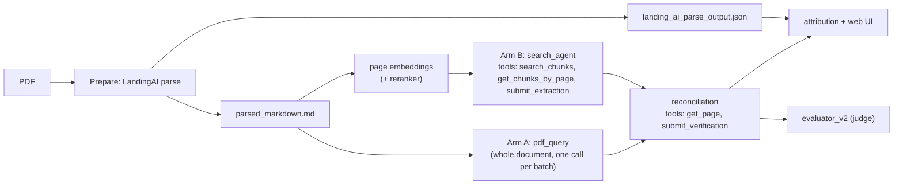

# EviSearch (CoRal-Map-Make)

Extracts a 133-column clinical-trial table from research papers with two independent extraction arms,
reconciles their answers, attributes every value to the page it came from, and scores the result against
a gold table. Every model call goes through one inference layer, so the same code runs on **local models
served by vLLM on the H200s** or on **Gemini / OpenAI**, selected by configuration.


```mermaid
flowchart LR
    PDF --> Prep["Prepare: LandingAI parse"]
    Prep --> MD[parsed_markdown.md]
    Prep --> PJ[landing_ai_parse_output.json]
    MD --> A["Arm A: pdf_query<br/>(whole document, one call per batch)"]
    MD --> Emb["page embeddings<br/>(+ reranker)"]
    Emb --> B["Arm B: search_agent<br/>tools: search_chunks, get_chunks_by_page, submit_extraction"]
    A --> R["reconciliation<br/>tools: get_page, submit_verification"]
    B --> R
    R --> Attr["attribution + web UI"]
    PJ --> Attr
    R --> Eval["evaluator_v2 (judge)"]
```

## Quick start

```bash
python -m venv venv && source venv/bin/activate
pip install -r requirements-dev.txt
cp .env.example .env                              # fill in the keys your preset needs (see below)
python -m src.config                              # what this run will use
python -m pytest -q                               # offline tests, no keys or GPUs needed
```

## Configuration

Three files, three jobs:

| File | Holds | Changes when |
|---|---|---|
| `src/config/catalog.yaml` | **Every option that exists**: endpoints, models and their capabilities (`tools`, `json_schema`, `images`, `pdf`, context size, price), pipeline roles and what they require, local vLLM server specs, presets, enumerated options | you add a model or server |
| `src/config/config.py` | **What this run uses**: preset, per-role overrides, options, GPU pool and placement, token budgets. Validated against the catalog on import | per run / experiment |
| `src/config/runtime_paths.py` | Where results, embeddings, uploads and feedback live | rarely |
| `.env` | Secrets only: `VERTEX_API_KEY` (or `GOOGLE_CLOUD_PROJECT` + ADC), `OPENAI_API_KEY`, `VISION_AGENT_API_KEY` | rarely |

Code never names a provider or model; it asks for a role (`get_chat("search_agent")`, `get_embedder()`,
`get_reranker()`). Roles: `pdf_query`, `search_agent`, `reconciliation`, `qa`, `judge`, `baseline`,
`structurer`, `embedding`, `reranker`.

### Presets

| Preset | Agents (A, B, reconciliation, QA) | Embeddings / reranker | Judge + baselines | Needs |
|---|---|---|---|---|
| `local` (default) | Qwen3.6-27B on vLLM | Qwen3-Embedding-8B / Qwen3-Reranker-8B on vLLM | Gemini 2.5 Flash (scores stay comparable) | vLLM servers + Vertex auth |
| `offline` | Qwen3.6-27B | Qwen3 embedding / reranker | Qwen3.6-27B | vLLM servers only |
| `cloud` | Gemini 2.5 Flash | OpenAI text-embedding-3-large / none | Gemini 2.5 Flash | Vertex auth + `OPENAI_API_KEY` |

### Switching without editing files

```bash
EVISEARCH_PRESET=cloud python experiment-scripts/run_search_agent.py "<doc_id>"
EVISEARCH_ROLE_JUDGE=gemini-2.5-pro python -m src.evaluation.evaluator_v2 ...   # override one role
EVISEARCH_ROLE_RERANKER=none ...                                              # disable reranking
EVISEARCH_PDF_QUERY_INPUT=pdf ...          # Arm A reads the PDF itself (model must support pdf)
EVISEARCH_RECONCILIATION_PAGE_IMAGES=never ...
EVISEARCH_VLLM_CHAT_URL=http://gpu-box:8002/v1 ...   # use a vLLM server running elsewhere
```

An invalid choice fails immediately and lists the valid ones, e.g.
`role 'search_agent' needs a chat model, but 'qwen3-embedding-8b' has kind=embedding. Valid: qwen3.6-27b, qwen3-8b, gemini-2.5-flash, ...`.
`python -m src.config --check` also verifies credentials and that the needed local servers answer `/health`.

### Adding a model

Add it under `models:` in `catalog.yaml` with its endpoint and capabilities (and a `servers:` entry if it
runs locally), then select it in a preset, `ROLE_OVERRIDES`, or `EVISEARCH_ROLE_<ROLE>`. Any
OpenAI-compatible API (vLLM, OpenAI, DeepInfra, Groq, ...) only needs an `endpoints:` entry with `base_url`
and `api_key_env`.

## Local models (vLLM on the H200s)

Install vLLM into the project environment (it pins its own PyTorch version):

```bash
pip install -r requirements-local.txt
```

The launcher uses the `vllm` next to the running Python, so the venv does not need to be activated. To use
a vLLM installed elsewhere, set `EVISEARCH_VLLM_BIN=/path/to/vllm`.

Start the servers the current selection needs:

```bash
python -m src.inference.serve --dry-run   # GPU placement + exact vllm commands
python -m src.inference.serve --detach    # start in the background, wait until healthy
python -m src.inference.serve --status
python -m src.inference.serve --stop
python -m src.inference.serve --only qwen36_27b
```

| Server | Model | Port | Default memory | Notes |
|---|---|---|---|---|
| `qwen36_27b` | Qwen/Qwen3.6-27B | 8002 | 0.90 of one GPU | `--tool-call-parser qwen3_coder --reasoning-parser qwen3`, thinking off, 65k context, images on, PyTorch sampler (`VLLM_USE_FLASHINFER_SAMPLER=0`: FlashInfer's JIT kernels cannot be built with the pip CUDA wheels) |
| `qwen3_embed_8b` | Qwen/Qwen3-Embedding-8B | 8003 | 0.40 | `--runner pooling` |
| `qwen3_rerank_8b` | Qwen/Qwen3-Reranker-8B | 8004 | 0.40 | pooling + `hf_overrides`, template in `src/config/templates/` |
| `qwen3_8b` | Qwen/Qwen3-8B | 8006 | 0.40 | optional small chat model |

**GPUs** are chosen in `config.py`: `GPU_POOL` lists the GPUs the project may use and `GPUS` pins a server
to indices or `"auto"` (least-used pool GPUs). Before starting, the launcher reads `nvidia-smi` and refuses
a GPU whose used memory plus the server's `gpu_memory_utilization` would exceed `GPU_MAX_MEMORY_FRACTION`
(servers can share a GPU when they fit). Environment: `EVISEARCH_GPU_POOL="0,1,2,3"`,
`EVISEARCH_GPUS="qwen36_27b=0;qwen3_embed_8b=1;qwen3_rerank_8b=1"`. Logs go to `.cache/serve/`.

Agents on models with a finite context window drop their oldest tool outputs (and let the model re-fetch
those pages) when a conversation would not fit.

## Running the pipeline

All CLIs share flags: `--groups "A,B"`, `--no-resume`, `--max-batches N`, `--model <catalog key>`, `--dry-run`.

```bash
python experiment-scripts/run_pdf_query_agent.py "<doc_id>"            # Arm A  (--input markdown|pdf)
python experiment-scripts/run_search_agent.py "<doc_id>"               # Arm B
python experiment-scripts/run_reconciliation_agent.py "<doc_id>"       # needs both arms' results
shell-scripts/run_benchmarks.sh full [--resume] [--max-batches 1]      # all benchmark trials
```

Documents must be prepared first (LandingAI parse → `parsed_markdown.md`); the web app does this from
the extract and QA pages, and the benchmark papers already have parsed markdown.

**Web app:** `shell-scripts/start_web_interface.sh` (or `python web/main_app.py`) →
`http://127.0.0.1:8007` with `/extract`, `/qa`, `/attribution`, `/comparison-report`,
`/method-comparison-report`.

## Deploying the demo (Fly.io)

`fly.toml` runs the `Dockerfile` on one `shared-cpu-2x` / 2 GB machine with the `cloud` preset (Fly has no
GPUs) and a 5 GB volume at `/data` for uploads, results, embeddings and feedback. On startup the app
copies the outputs shipped in `new_pipeline_outputs/` onto the volume without overwriting, so edits and
uploads survive redeploys. Setting `EVISEARCH_DEMO_PASSWORD` puts the whole site behind HTTP Basic auth
(user `evisearch`, or `EVISEARCH_DEMO_USER`); `/healthz` stays open for Fly's health check.

```bash
curl -L https://fly.io/install.sh | sh && export PATH="$HOME/.fly/bin:$PATH"
fly auth login                        # add a card: the trial stops machines after 5 minutes
fly apps create evisearch            # names are global; if taken, change `app` in fly.toml too
fly secrets set --stage -a evisearch VERTEX_API_KEY=... OPENAI_API_KEY=... \
    VISION_AGENT_API_KEY=... EVISEARCH_DEMO_PASSWORD=...
fly deploy --ha=false                 # builds remotely; creates the volume on first deploy
fly status && fly logs                # then open https://evisearch.fly.dev
```

Keep it to one machine (`--ha=false`, no `fly scale count`): the volume attaches to one machine and running
jobs live in memory. The machine stops when idle and starts on the next request, so an extraction dies if
every browser tab closes mid-run.

## Evaluation and baselines

```bash
python -m src.evaluation.evaluator_v2 <extraction_metadata.json> "<doc_id>" <output_dir> [--model gemini-2.5-pro]
python experiment-scripts/evaluate_reconciliation_output.py [--doc "<doc_id>"]
python experiment-scripts/baseline_landing_ai_w_gemini.py --trial "<doc_id>" --model gemini-2.5-flash
python experiment-scripts/baseline_landing_ai_w_gpt4.py --trial "<doc_id>" --model gpt-4.1
python experiment-scripts/baseline_file_search_gemini_native.py --pdf "dataset/<doc_id>.pdf" --model gemini-2.5-flash
python experiment-scripts/baseline_file_search_free_form.py --pdf "dataset/<doc_id>.pdf" --model gpt-4.1
shell-scripts/run_baselines.sh
```

Baseline `--model` values are catalog keys; results are written per model under
`experiment-scripts/<baseline>/results/<model>/<doc_id>/`.

## Code map

| Path | What |
|---|---|
| `src/config/` | catalog, selection (`config.py`), runtime paths, `python -m src.config` |
| `src/inference/` | `types.py` (messages, tools, results), `openai_compat.py` (OpenAI + vLLM chat/embeddings), `gemini.py`, `rerank.py`, `factory.py` (roles → models, credential/health checks, cost), `tool_loop.py`, `serve.py` (vLLM launcher) |
| `src/retrieval/` | `embedding_retriever.py` (page embeddings cached per model, reranking), `markdown_preprocessor.py` |
| `src/evisearch/services/` | `pdf_query.py` (Arm A), `search.py` (Arm B), `reconciliation.py`, `preparation.py` (LandingAI), attribution, highlight, reports, baselines |
| `src/evisearch/pipelines/` | batch runners + CLIs for each arm, `unified_extraction.py` (web), shared `batching.py` and `results_store.py` |
| `src/evaluation/` | `evaluator_v2.py` (judge role), Excel export |
| `web/main_app.py`, `apps/web/frontend/` | Flask app and templates |
| `experiment-scripts/` | thin CLIs, baselines, analysis scripts |
| `tests/` | offline tests (scripted models, mocked HTTP) |

### Using the inference layer

```python
from src.inference import Message, Tool, ToolOutput, ToolSpec, get_chat, run_tool_loop

chat = get_chat("search_agent")            # model from config.py; get_chat("baseline", "gpt-4.1") overrides
result = chat.chat([Message.system("..."), Message.user("...")], response_schema={...})
data = result.json()

loop = run_tool_loop(chat, system="...", user="...", max_turns=25, max_tool_calls=15, max_tokens=8192,
                     tools=[Tool(ToolSpec("get_page", "Load pages", {...json schema...}), handler)])
```

Tools are declared once as JSON schema. The OpenAI-compatible adapter sends them as `tools` (vLLM parses
Qwen's tool-call format server-side); the Gemini adapter sends function declarations and replays the
model's own turns verbatim so thought signatures survive. Page images from tools are attached the way each
API requires. Structured output uses `response_format: json_schema` (OpenAI/vLLM) or `response_schema` (Gemini).

## Outputs

```text
new_pipeline_outputs/
├── results/<doc_id>/
│   ├── chunking/            parsed_markdown.md, landing_ai_parse_output.json
│   ├── agent_extractor/     extraction_results.json, extraction_metadata.json, raw_llm_responses/
│   ├── search_agent/        extraction_results.json, extraction_metadata.json, verification_logs/
│   └── reconciliation_agent/ reconciled_results.json, extraction_metadata.json, verification_logs/, evaluation/
├── chunk_embeddings/        <doc_id>_<embedding model>_markdown.npz
└── feedback/
```

Per-column results always have `{value, reasoning, found, attribution: [{page, modality}], tried}`;
reconciled columns add `verification` and `source` (with `verbatim_quote` for text).
