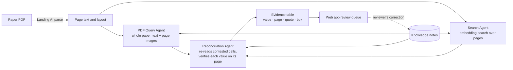

# EviSearch

**Agentic extraction of clinical-trial evidence tables: every value cited to its page, open-weight models, and a
knowledge base that improves with every review.**

[Live demo](https://evisearch.fly.dev) · [Project page](https://coral-lab-asu.github.io/EviSearch/)

EviSearch fills a 133-column evidence table from randomised-trial publications. Two extraction agents read each paper
independently; a Reconciliation Agent adjudicates between them, re-reads the cells they dispute, and admits a value
only once it has been read on its cited page. The web app shows each value boxed on its PDF page, queues the cells
the agents disagree on for review, and turns a reviewer's correction into an edit to the knowledge notes that every
later extraction reads.

- **Traceable.** Every admitted value carries its page, quotation and modality, checked by a second reading.
- **Private.** The agents run on open-weight models (Qwen3.6-27B, Qwen3-Embedding-8B), on your own GPU or through a
  hosted provider. Layout parsing is one Landing AI call per paper.
- **Improves with use.** Corrections become markdown knowledge notes, frozen per run so results stay reproducible.

## Architecture


```mermaid
flowchart LR
    PDF[Paper PDF] -->|Landing AI parse| P[Page text and layout]
    P --> A["PDF Query Agent<br/>whole paper, text + page images"]
    P --> B["Search Agent<br/>embedding search over pages"]
    KB[(Knowledge notes)] --> A
    KB --> B
    KB --> R
    A --> R["Reconciliation Agent<br/>re-reads contested cells,<br/>verifies each value on its page"]
    B --> R
    R --> T["Evidence table<br/>value · page · quote · box"]
    T --> UI[Web app review queue]
    UI -. "reviewer's correction" .-> KB
```

The two extraction agents run in parallel, and every column batch of a stage runs at once; the Reconciliation
Agent's batch *k* waits only for the agents' batch *k*. On OpenRouter a paper takes about five minutes end to end
(about $1–2 in model calls).

## Quick start

```bash
git clone https://github.com/CoRAL-ASU/EviSearch && cd EviSearch
python3.11 -m venv venv && source venv/bin/activate
pip install -r requirements.txt
cp .env.example .env          # add OPEN_ROUTER_API_KEY (and VISION_AGENT_API_KEY to parse new PDFs)
python -m src.config --check  # shows the models in use and checks the keys
python web/main_app.py        # http://127.0.0.1:8007
```

The ten benchmark papers ship parsed, with two finished runs. Open **Tables → mHSPC trials** for the table,
**Review** for the flagged cells beside their PDF pages, and **Knowledge** for the notes the prompts read. To extract
papers, open the table's **Papers** tab, choose papers and press **Extract papers**.

The same extraction from the command line:

```bash
python experiment-scripts/run_schema.py --schema mhspc-trials-20260919020503 --docs "NCT00104715_Gravis_GETUG_EU'15"
```

## Running offline on your own GPU

```bash
pip install -r requirements-local.txt        # adds vLLM
python -m src.inference.serve --detach       # Qwen3.6-27B and Qwen3-Embedding-8B on one GPU
EVISEARCH_PRESET=local python web/main_app.py
```

Presets are defined in `src/config/catalog.yaml`: `openrouter` (default), `local`, `offline` and `cloud_openai`.
Select one with `EVISEARCH_PRESET`; `python -m src.config` prints the resulting selection.

## Reproducing the paper

Every number in the paper is computed by a script in `experiment-analysis/` from saved runs and the judge's rubric
labels, without calling a model. The runs and labels are kept outside git (about 400 MB); with them in
`new_pipeline_outputs/` and `experiment-scripts/scoring/`:

```bash
python experiment-analysis/paper_numbers.py   # Tables 1 and 2, Figure 2
python experiment-analysis/gate_ablation.py   # Appendix B
```

`experiment-analysis/paper_runs.py` names every run the paper reports. `run_schema.py --system B1` re-runs the
single-pass baseline, and `--kb off` re-runs without the knowledge notes.

## Repository

| Path | Contents |
|---|---|
| `src/evisearch/services/` | the agents (`pdf_query.py`, `search.py`, `reconciliation_v5.py`), the attribution verifier, the evidence locator |
| `src/evisearch/knowledge/` | knowledge notes, and the proposer that turns a correction into a note edit |
| `src/inference/` | model clients, the vLLM launcher, concurrency limits |
| `src/config/` | `catalog.yaml` (models, presets) and `config.py` (the selection) |
| `web/`, `apps/web/` | the Flask app and its pages |
| `experiment-scripts/` | the extraction launcher and per-stage command-line tools |
| `experiment-analysis/` | the scripts behind the paper's numbers |
| `new_pipeline_outputs/` | results, page embeddings, schema versions, knowledge notes |

Tests run offline, with no keys or GPU: `python -m pytest -q`. To deploy the demo, run `shell-scripts/deploy_fly.sh`
(Fly.io, `openrouter` preset).
