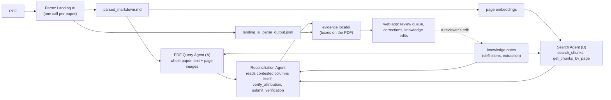

# EviSearch

Extracts a clinical-trial evidence table (133 columns) from research papers with three agents, cites every value to
the page it came from, and learns from the curator's reviews through a knowledge base of markdown notes. The agents
run on open-weight models served locally by vLLM, so the agentic system is entirely offline; layout parsing is one
Landing AI call per document.


```mermaid
flowchart LR
    PDF --> Prep["Parse: Landing AI<br/>(one call per paper)"]
    Prep --> MD[parsed_markdown.md]
    Prep --> PJ[landing_ai_parse_output.json]
    MD --> A["PDF Query Agent (A)<br/>whole paper, text + page images"]
    MD --> Emb["page embeddings"]
    Emb --> B["Search Agent (B)<br/>search_chunks, get_chunks_by_page"]
    KB["knowledge notes<br/>(definitions, extraction)"] --> A
    KB --> B
    KB --> R
    A --> R["Reconciliation Agent<br/>reads contested columns itself,<br/>verify_attribution, submit_verification"]
    B --> R
    R --> Loc["evidence locator<br/>(boxes on the PDF)"]
    PJ --> Loc
    Loc --> UI["web app: review queue,<br/>corrections, knowledge edits"]
    UI -. "a reviewer's edit" .-> KB
```

## Quick start

```bash
python -m venv venv && source venv/bin/activate
pip install -r requirements-dev.txt
cp .env.example .env                              # fill in the keys your preset needs (see below)
python -m src.config                              # what this run will use
python -m pytest -q                               # offline tests, no keys or GPUs needed
```

## Configuration

Three files, three jobs:

| File | Holds | Changes when |
|---|---|---|
| `src/config/catalog.yaml` | **Every option that exists**: endpoints, models and their capabilities (`tools`, `json_schema`, `images`, `pdf`, context size, price), pipeline roles and what they require, local vLLM server specs, presets, enumerated options | you add a model or server |
| `src/config/config.py` | **What this run uses**: preset, per-role overrides, options, GPU pool and placement, token budgets. Validated against the catalog on import | per run / experiment |
| `src/config/runtime_paths.py` | Where results, embeddings, uploads and feedback live | rarely |
| `.env` | Secrets only: `VERTEX_API_KEY` (or `GOOGLE_CLOUD_PROJECT` + ADC), `OPENAI_API_KEY`, `VISION_AGENT_API_KEY` | rarely |

Code never names a provider or model; it asks for a role (`get_chat("search_agent")`, `get_embedder()`,
`get_reranker()`). Roles: `pdf_query`, `search_agent`, `reconciliation`, `qa`, `judge`, `baseline`,
`structurer`, `embedding`, `reranker` (no preset selects one).

### Presets

| Preset | Agents (A, B, reconciliation, QA) | Embeddings | Needs |
|---|---|---|---|
| `local` (default) | Qwen3.6-27B on vLLM | Qwen3-Embedding-8B on vLLM | vLLM servers |
| `offline` | Qwen3.6-27B | Qwen3-Embedding-8B | vLLM servers only |
| `novita`, `together` | the provider's served open-weight model | Qwen3-Embedding-8B on vLLM | the provider's API key and model id |
| `cloud_openai` | an OpenAI chat model | OpenAI text-embedding-3-large | `OPENAI_API_KEY` |

Retrieval is by embedding alone in every preset.

### Switching without editing files

```bash
EVISEARCH_PRESET=cloud python experiment-scripts/run_search_agent.py "<doc_id>"
EVISEARCH_PDF_QUERY_INPUT=markdown ...     # PDF Query Agent without page images (default markdown_images: each page's text + image)
EVISEARCH_RUN=qwen_md_images ...           # keep this run's results apart: results/<doc_id>/runs/qwen_md_images/
EVISEARCH_RECONCILIATION_PAGE_IMAGES=never ...
EVISEARCH_VLLM_CHAT_URL=http://gpu-box:8002/v1 ...   # use a vLLM server running elsewhere
```

An invalid choice fails immediately and lists the valid ones, e.g.
`role 'search_agent' needs a chat model, but 'qwen3-embedding-8b' has kind=embedding. Valid: qwen3.6-27b, qwen3-8b, gemini-2.5-flash, ...`.
`python -m src.config --check` also verifies credentials and that the needed local servers answer `/health`.

### Adding a model

Add it under `models:` in `catalog.yaml` with its endpoint and capabilities (and a `servers:` entry if it
runs locally), then select it in a preset, `ROLE_OVERRIDES`, or `EVISEARCH_ROLE_<ROLE>`. Any
OpenAI-compatible API (vLLM, OpenAI, DeepInfra, Groq, ...) only needs an `endpoints:` entry with `base_url`
and `api_key_env`.

## Local models (vLLM on the H200s)

Install vLLM into the project environment (it pins its own PyTorch version):

```bash
pip install -r requirements-local.txt
```

The launcher uses the `vllm` next to the running Python, so the venv does not need to be activated. To use
a vLLM installed elsewhere, set `EVISEARCH_VLLM_BIN=/path/to/vllm`.

Start the servers the current selection needs:

```bash
python -m src.inference.serve --dry-run   # GPU placement + exact vllm commands
python -m src.inference.serve --detach    # start in the background, wait until healthy
python -m src.inference.serve --status
python -m src.inference.serve --stop
python -m src.inference.serve --only qwen36_27b
```

| Server | Model | Port | Default memory | Notes |
|---|---|---|---|---|
| `qwen36_27b` | Qwen/Qwen3.6-27B | 8002 | 0.90 of one GPU | `--tool-call-parser qwen3_coder --reasoning-parser qwen3`, thinking off, 131k context, up to 32 images per prompt, cached-token counts in usage (`--enable-prompt-tokens-details`), PyTorch sampler (`VLLM_USE_FLASHINFER_SAMPLER=0`: FlashInfer's JIT kernels cannot be built with the pip CUDA wheels) |
| `qwen3_embed_8b` | Qwen/Qwen3-Embedding-8B | 8005 | 0.40 | `--runner pooling` (8003 is used by another group's server on this machine) |
| `qwen3_8b` | Qwen/Qwen3-8B | 8006 | 0.40 | optional small chat model |

**GPUs** are chosen in `config.py`: `GPU_POOL` lists the GPUs the project may use and `GPUS` pins a server
to indices or `"auto"` (least-used pool GPUs). Before starting, the launcher reads `nvidia-smi` and refuses
a GPU whose used memory plus the server's `gpu_memory_utilization` would exceed `GPU_MAX_MEMORY_FRACTION`
(servers can share a GPU when they fit). Environment: `EVISEARCH_GPU_POOL="0,1,2,3"`,
`EVISEARCH_GPUS="qwen36_27b=0;qwen3_embed_8b=1"`. Logs go to `.cache/serve/`.

Agents on models with a finite context window drop their oldest tool outputs (and let the model re-fetch
those pages) when a conversation would not fit.

## Running the pipeline

The web app runs extractions for you: lock a schema version, pick papers on the table's Papers tab, and press Extract.
The same run from the command line:

```bash
python experiment-scripts/run_schema.py --schema <table id> --docs "<doc_id>,<doc_id>"   # latest locked version
```

Each run reads the knowledge notes as they are at launch (frozen under `knowledge/note_snapshots/`, and recorded in
every stage's metadata as `notes:<fingerprint>`), so editing a note never changes a run in flight. Results go to
`new_pipeline_outputs/results/<doc_id>/runs/schema-<table>-v<N>[-rK]/`, and resuming refuses saved results made with
another model, input, reconciler or set of notes.

The stages can also be run one at a time (shared flags `--groups`, `--no-resume`, `--max-batches N`, `--model`,
`--run`, `--dry-run`):

```bash
python experiment-scripts/run_pdf_query_agent.py "<doc_id>"            # PDF Query Agent
python experiment-scripts/run_search_agent.py "<doc_id>"               # Search Agent
python experiment-scripts/run_reconciliation_agent.py "<doc_id>"       # needs both agents' results
```

Documents are parsed first (Landing AI → `results/<doc_id>/chunking/parsed_markdown.md`); the web app does this when a
paper is added, and the benchmark papers ship parsed.

**Web app:** `shell-scripts/start_web_interface.sh` (or `python web/main_app.py`) → `http://127.0.0.1:8007`: Tables
(schema design and review, papers, runs), Review (the flagged-cell queue beside the PDF), Knowledge (the notes the
prompts read), Learning (what reviews changed), Benchmark (the reference table), Ask (questions over one paper).

## Reproducing the paper's numbers

Every number in the paper comes from a script in `experiment-analysis/` over saved runs and the judge's rubric labels
(`experiment-scripts/scoring/`); none calls a model. `experiment-analysis/paper_runs.py` says where each run lives:
the system's two runs in `new_pipeline_outputs/results/`, the comparisons that are not the system (the single-pass
baseline, the agreement-gated admission variant, the knowledge-off schema ladder) in `new_pipeline_outputs/paper_runs/`.

```bash
python experiment-analysis/paper_numbers.py        # Table 1, Table 2, Figure 2 (refuses to report unjudged cells)
python experiment-analysis/provenance.py <run> ... # citation coverage and corroboration
python experiment-analysis/evidence_locations.py audit <run> ...   # how often the value itself is highlighted
python experiment-analysis/triage.py <run>         # review queue: share of errors inside it, precision
python experiment-analysis/gate_ablation.py        # Appendix B: agreement- vs provenance-gated admission
python experiment-analysis/reference_audit.py      # Appendix A: reference values contradicting their page
python experiment-analysis/stage_timings.py        # minutes per paper, per stage
```

The two comparison systems can be re-run with the same launcher: `--system B1` (the single-pass baseline) and
`--kb off` (the fixed extraction guidelines instead of the knowledge notes).

## Code map

| Path | What |
|---|---|
| `src/config/` | catalog, selection (`config.py`), runtime paths, `python -m src.config` |
| `src/inference/` | `types.py` (messages, tools, results), `openai_compat.py` (OpenAI + vLLM chat/embeddings), `gemini.py`, `rerank.py`, `factory.py` (roles → models, credential/health checks, cost), `tool_loop.py`, `serve.py` (vLLM launcher) |
| `src/retrieval/` | `embedding_retriever.py` (page embeddings cached per model), `markdown_preprocessor.py` |
| `src/evisearch/services/` | `pdf_query.py` (PDF Query Agent), `search.py` (Search Agent), `reconciliation_v5.py` (Reconciliation Agent, on the shared session in `reconciliation.py`), `evidence_check.py` (the attribution verifier), `evidence_locator.py` (boxes on the PDF), `preparation.py` (Landing AI), `markdown_baseline.py` (the single-pass baseline) |
| `src/evisearch/knowledge/` | `notes.py` (the notes tree, snapshots, edit log), `proposer.py` (a reviewer's correction → a proposed note edit) |
| `src/evisearch/pipelines/` | batch runners + CLIs for each arm, `unified_extraction.py` (web), shared `batching.py` and `results_store.py` |
| `src/evaluation/` | `evaluator_v2.py` (judge role), Excel export |
| `web/main_app.py`, `apps/web/frontend/` | Flask app and templates |
| `experiment-scripts/` | the launcher (`run_schema.py` → `run_benchmark.py`), per-stage CLIs, `check_run.py`, the judge's rubric |
| `experiment-analysis/` | the scripts behind every number in the paper |
| `tests/` | offline tests (scripted models, mocked HTTP) |

### Using the inference layer

```python
from src.inference import Message, Tool, ToolOutput, ToolSpec, get_chat, run_tool_loop

chat = get_chat("search_agent")            # model from config.py; get_chat("baseline", "gpt-4.1") overrides
result = chat.chat([Message.system("..."), Message.user("...")], response_schema={...})
data = result.json()

loop = run_tool_loop(chat, system="...", user="...", max_turns=25, max_tool_calls=15, max_tokens=8192,
                     tools=[Tool(ToolSpec("get_page", "Load pages", {...json schema...}), handler)])
```

Tools are declared once as JSON schema. The OpenAI-compatible adapter sends them as `tools` (vLLM parses
Qwen's tool-call format server-side); the Gemini adapter sends function declarations and replays the
model's own turns verbatim so thought signatures survive. Page images from tools are attached the way each
API requires. Structured output uses `response_format: json_schema` (OpenAI/vLLM) or `response_schema` (Gemini).

## Outputs

```text
new_pipeline_outputs/
├── results/<doc_id>/
│   ├── chunking/            parsed_markdown.md, landing_ai_parse_output.json
│   └── runs/<run>/
│       ├── agent_extractor/     extraction_results.json, extraction_metadata.json, raw_llm_responses/
│       ├── search_agent/        extraction_results.json, extraction_metadata.json
│       └── reconciliation_agent/ reconciled_results.json, evidence_locations.json, extraction_metadata.json
├── paper_runs/              the paper's comparison runs (same layout), not shown in the web app
├── knowledge/               notes/{definitions,extraction}/*.md, note_snapshots/, notes_log.jsonl
├── chunk_embeddings/        <doc_id>_<embedding model>_markdown.npz
└── feedback/
```

Per-column results always have `{value, reasoning, found, attribution: [{page, modality}], tried}`;
reconciled columns add `verification` and `source` (with `verbatim_quote` for text).
