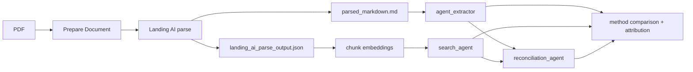

# CoRal-Map-Make

Clinical-trial PDF extraction system with a shared runtime for:

- document preparation with Landing AI parse + embedding cache
- `agent_extractor` / PDF-query extraction
- `search_agent` / retrieval-guided extraction
- `reconciliation_agent` / A-vs-B resolution
- attribution highlighting and method-comparison reporting

The current codebase is centered on `src/evisearch`. The older plan-generator / plan-executor stack has been removed.

## Current architecture


```mermaid
flowchart LR
    A[PDF] --> B[Prepare Document]
    B --> C[Landing AI parse]
    C --> D[parsed_markdown.md]
    C --> E[landing_ai_parse_output.json]
    D --> F[agent_extractor]
    E --> G[chunk embeddings]
    G --> H[search_agent]
    F --> I[reconciliation_agent]
    H --> I
    F --> J[method comparison + attribution]
    H --> J
    I --> J
```

## Source of truth

There is one active application layer:

- `src/evisearch/services/`: business logic for preparation, extraction, search, reconciliation, attribution, reports
- `src/evisearch/pipelines/`: orchestration and batching used by scripts and web
- `web/main_app.py`: Flask app that calls the same `src/evisearch` modules
- `experiment-scripts/`: thin CLIs and benchmark wrappers around the same services/pipelines

That split matters:

- `services` implement the actual behavior
- `pipelines` coordinate multi-batch runs, resume logic, and per-agent output writing
- scripts and web should stay thin and call into `src/evisearch`, not duplicate logic

## Repo map

### Core runtime

- `src/evisearch/services/preparation.py`
  - runs Landing AI parse
  - writes `parsed_markdown.md` and `landing_ai_parse_output.json`
- `src/evisearch/services/markdown_pdf_query.py`
  - full-markdown PDF-query extractor
  - keeps the same output contract as `agent_extractor`
- `src/evisearch/services/search.py`
  - retrieval-guided search agent
  - uses semantic search over cached page/chunk embeddings
- `src/evisearch/services/reconciliation.py`
  - resolves disagreements between Agent A and Agent B
- `src/evisearch/services/attribution.py`
  - maps agent/source attribution back to Landing AI chunks
- `src/evisearch/services/highlight.py`
  - resolves highlight chunk IDs and PDF highlight spans for the UI
- `src/evisearch/services/reports.py`
  - loads outputs from agents and baselines for comparison/report pages

### Orchestration

- `src/evisearch/pipelines/unified_extraction.py`
  - shared batching logic
  - parallel Agent A + Search Agent orchestration for the app
- `src/evisearch/pipelines/search_pipeline.py`
  - batch runner for `search_agent`
- `src/evisearch/pipelines/reconciliation_pipeline.py`
  - batch runner for `reconciliation_agent`

### Provider layer

- `src/LLMProvider/provider.py`
  - unified provider interface
  - supports `gemini`, `openai`, `novita`, `groq`, `deepinfra`, `local`
- `local` means OpenAI-compatible inference, typically a vLLM endpoint

### Web app

- `web/main_app.py`
  - active Flask entrypoint
- `apps/web/frontend/`
  - templates and static assets
- `apps/web/backend/app.py`
  - compatibility import wrapper around `web.main_app`

### Experiment CLIs

- `experiment-scripts/run_markdown_pdf_query_agent.py`
- `experiment-scripts/run_search_agent.py`
- `experiment-scripts/run_reconciliation_agent.py`
- `experiment-scripts/run_local_search_agent.py`
  - compatibility wrapper around `src/evisearch/pipelines/search_pipeline.py`

## Runtime layout

Runtime paths are defined in `src/config/runtime_paths.py`.

Default locations:

```text
new_pipeline_outputs/
├── results/
│   └── <doc_id>/
│       ├── chunking/
│       │   ├── parsed_markdown.md
│       │   └── landing_ai_parse_output.json
│       ├── agent_extractor/
│       │   ├── extraction_results.json
│       │   ├── extraction_metadata.json
│       │   └── raw_llm_responses/
│       ├── search_agent/
│       │   ├── extraction_results.json
│       │   ├── extraction_metadata.json
│       │   └── verification_logs/
│       └── reconciliation_agent/
│           ├── reconciled_results.json
│           ├── extraction_metadata.json
│           └── verification_logs/
├── chunk_embeddings/
└── feedback/
```

Path overrides:

- `EVISEARCH_RUNTIME_ROOT`
- `EVISEARCH_RESULTS_ROOT`
- `EVISEARCH_CHUNK_EMBEDDINGS_DIR`
- `EVISEARCH_UPLOADS_DIR`
- `EVISEARCH_FEEDBACK_DIR`
- `EVISEARCH_DATASET_DIR`

## Agent flows

### 1. Preparation

Preparation is required before retrieval-based workflows.

It does two things:

1. runs Landing AI parse and stores:
   - `parsed_markdown.md`
   - `landing_ai_parse_output.json`
2. builds embedding cache used by retrieval/search

Preparation is triggered from the web app via `/api/qa/prepare-document`.

### 2. Agent extractor

Current local-friendly implementation:

- reads full `parsed_markdown.md`
- sends markdown + column definitions to the model
- expects JSON output in the existing `agent_extractor` contract
- writes page/modality attribution in the same result shape used elsewhere

Primary module:

- `src/evisearch/services/markdown_pdf_query.py`

CLI:

```bash
python experiment-scripts/run_markdown_pdf_query_agent.py "<doc_id>"
```

### 3. Search agent

The search agent is retrieval-guided:

- searches embedding-backed chunks/pages
- optionally loads specific pages directly
- submits extracted values plus page/modality attribution

Primary module:

- `src/evisearch/services/search.py`

CLI:

```bash
python experiment-scripts/run_search_agent.py "<doc_id>"
```

### 4. Reconciliation agent

The reconciliation agent reads:

- `agent_extractor/extraction_results.json`
- `search_agent/extraction_results.json`

and writes:

- `reconciliation_agent/reconciled_results.json`

Primary module:

- `src/evisearch/services/reconciliation.py`

CLI:

```bash
python experiment-scripts/run_reconciliation_agent.py "<doc_id>"
```

## Provider configuration

### Gemini

Gemini is the only provider in this repo that currently supports native PDF upload through `LLMProvider.generate_with_pdf(...)`.

Relevant auth:

- `VERTEX_API_KEY`
- or `GOOGLE_CLOUD_PROJECT` + `GOOGLE_CLOUD_LOCATION` with ADC/service-account auth

### Local OpenAI-compatible endpoint

Use `provider=local` to target a vLLM or other OpenAI-compatible server.

Relevant env:

- `LOCAL_OPENAI_BASE_URL`
- `LOCAL_OPENAI_API_KEY`
- `LOCAL_OPENAI_MODEL`

Agent-specific overrides:

- `PDF_QUERY_PROVIDER`
- `PDF_QUERY_MODEL`
- `PDF_QUERY_MAX_TOKENS`
- `MARKDOWN_PDF_QUERY_MAX_CHARS`
- `SEARCH_AGENT_PROVIDER`
- `SEARCH_AGENT_MODEL`
- `SEARCH_AGENT_MAX_TOKENS`
- `RECONCILIATION_AGENT_PROVIDER`
- `RECONCILIATION_AGENT_MODEL`
- `RECONCILIATION_AGENT_MAX_TOKENS`

Current local PDF-query path is text-first: it uses `parsed_markdown.md`, not native PDF upload.

## Setup

### Python dependencies

Core code:

```bash
pip install -r src/requirements.txt
```

Web app:

```bash
pip install -r web/requirements.txt
```

Cloud Run image:

```bash
pip install -r requirements-cloudrun.txt
```

### Environment

The repo expects a root `.env` file for provider credentials and runtime config.

Common keys:

- Vertex / Gemini auth
- Landing AI auth: `VISION_AGENT_API_KEY` or `LANDING_AI_API_KEY`
- local inference endpoint vars if using vLLM

## Running the system

### Start the web app

```bash
python web/main_app.py
```

or:

```bash
./shell-scripts/start_web_interface.sh
```

Default URL:

```text
http://127.0.0.1:8007
```

### Run agents directly

Agent extractor:

```bash
python experiment-scripts/run_markdown_pdf_query_agent.py "<doc_id>" --provider local --model "Qwen/Qwen3.6-27B"
```

Search agent:

```bash
python experiment-scripts/run_search_agent.py "<doc_id>" --provider local --model "Qwen/Qwen3.6-27B"
```

Reconciliation agent:

```bash
python experiment-scripts/run_reconciliation_agent.py "<doc_id>" --provider local --model "Qwen/Qwen3.6-27B"
```

Smoke-test a partial run:

```bash
python experiment-scripts/run_search_agent.py "<doc_id>" --max-batches 1 --dry-run
python experiment-scripts/run_reconciliation_agent.py "<doc_id>" --max-batches 1 --dry-run
```

## Web surfaces

Current useful routes:

- `/`
- `/qa`
- `/extract`
- `/attribution`
- `/comparison-report`
- `/method-comparison-report`

Important report surface:

- `/method-comparison-report`
  - compares `agent_extractor`, `search_agent`, `reconciliation_agent`, and selected baselines against the same document/column set

## Attribution model

The active agent outputs use normalized source attribution:

```json
[
  { "page": 8, "modality": "table" }
]
```

The UI then resolves that source attribution back to Landing AI chunk IDs and highlight spans using:

- `src/evisearch/services/attribution.py`
- `src/evisearch/services/highlight.py`

That means highlights depend on `landing_ai_parse_output.json` being present and aligned with the page/modality evidence emitted by the agents.

## Notes on removed architecture

The old plan-based stack is no longer the active architecture. These components have been removed:

- `src/planning/plan_generator.py`
- `src/extraction/plan_executor.py`
- `src/main/main_v2.py`
- old planning verification scripts

If you see old references to:

- "Planning -> Extraction -> Evaluation"
- `plans_all_columns.json`
- `*_plan.json`
- `src/main/main_v2.py`

those are stale and should not be treated as the current system design.
